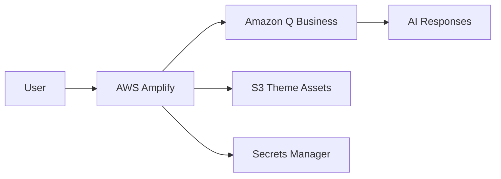

# Amazon Q Business Customized Web Application

[](LICENSE)
[](https://nodejs.org/)
[](https://aws.amazon.com/amplify/)

## Introduction

This scalable solution provides a customized Amazon Q Business web application designed to help public sector agencies securely fast-track their adoption of Generative AI.

The application features custom theming, session management with visual timers, and mobile-responsive design.


## Getting Started

#### Prerequisites:
- AWS Account with appropriate permissions
- Node.js 18+ installed locally
- AWS CLI configured
- Git repository
- Q Business Application (can be created by the script)

The AWS CLI needs to be configured with a profile that has CloudFormation, Amplify, Q Business, and Secrets Manager permissions.

**Usage Disclaimers:**

- You will be billed for AWS resources created by this solution
- Domain configuration is required for iframe embedding
- Local testing requires adding localhost to Q Business allowed URLs
- Session duration is configurable (15-60 minutes, default: 15)

## Setup

**Step 1: Clone the repository and install dependencies.**

```bash
git clone <repository-url>
cd qbamplify
npm install
```

**Step 2: Deploy the infrastructure.**

Deployment takes approximately 5-10 minutes.

```bash
./scripts/deploy.sh
```

The script will ask if you have existing Q Business resources and guide you through setup.

**Step 3: Configure allowed URLs for Q Business.**

Add allowed URLs to Q Business web experience:
- For local testing: `http://localhost:3000`
- For production: Your Amplify domain URL

Go to Q Business Console → Your Application → Web Experience → Allowed websites

**Step 4: Test locally (optional).**

```bash
npm start
```

Visit `http://localhost:3000` to test locally.

**Step 5: Deploy to Amplify.**

Connect your GitHub repository to AWS Amplify and deploy to production.

## Reference Architecture



Built with Express.js and deployed on AWS Amplify using CloudFormation for infrastructure management, this template creates a secure, themed Q Business deployment with the following components:

- **Q Business Application**: Anonymous access with custom theming
- **Web Experience**: Customized branding and styling
- **Amplify Hosting**: Server-side rendering with Express.js
- **Secrets Manager**: Secure storage of Q Business configuration
- **S3 Bucket**: Theme assets (CSS, fonts, logos)
- **IAM Roles**: Least-privilege permissions for Amplify compute

## Project Structure

```
qbamplify/
├── src/                    # Express.js application
├── config/                 # Configuration files
├── scripts/                # Build and deployment scripts
├── assets/                 # Theme assets (CSS, fonts, logos)
├── infrastructure/         # CloudFormation templates
└── docs/                   # Documentation
```

## Environment Configuration

The application handles environment variables differently across deployment environments:

### Local Development
- Node.js 22+ automatically loads `config/.env` file
- Variables are available directly via `process.env`

### AWS Amplify Deployment
- **Build Time**: Environment variables defined in `amplify.yml` are available during build
- **Runtime**: Build script captures these variables and writes them to `.env` file
- **Application**: Uses `dotenv.config()` to load the `.env` file at runtime

**Important**: Amplify environment variables from `amplify.yml` are only available during the build process, not at runtime. For server-side Express applications, the build script must transfer these variables to a `.env` file that gets deployed with the application.

### Variable Flow
```
Local: config/.env → Node.js auto-load → process.env
Amplify: amplify.yml → build script → .env file → dotenv.config() → process.env
```

## Documentation

- **[Setup Guide](docs/SETUP.md)** - Complete deployment and configuration
- **[Customization Guide](docs/CUSTOMIZATION.md)** - Theme and branding customization

## Local Development

```bash
# Clone and install
git clone <repository-url>
cd qbamplify
npm install

# Deploy infrastructure first
./scripts/deploy.sh

# Add localhost to Q Business allowed URLs
# Go to Q Business Console → Your Application → Web Experience → Allowed websites
# Add: http://localhost:3000

# Then start locally
npm start
```

Visit `http://localhost:3000` to test locally.

**Important**: 
- Local testing requires AWS credentials and the infrastructure to be deployed first
- **Must add `http://localhost:3000` to Q Business web experience allowed URLs** for iframe to load

## Deployment

1. **Deploy Infrastructure**: `./scripts/deploy.sh`
2. **Configure URLs**: Add allowed URLs to Q Business web experience:
   - For local testing: `http://localhost:3000`
   - For production: Your Amplify domain URL
3. **Test Locally**: `npm install && npm start`
4. **Deploy to Amplify**: Connect GitHub repository to AWS Amplify
5. **Customize**: Follow [Customization Guide](docs/CUSTOMIZATION.md)
6. **Cleanup**: `./scripts/cleanup.sh` (when needed)

## Support

- **Issues**: Use GitHub Issues for bug reports
- **Documentation**: Check the `docs/` directory
- **AWS Support**: Contact AWS Support for service-related issues

## Contributing

See [CONTRIBUTING.md](CONTRIBUTING.md) for contribution guidelines.

## License

This project is licensed under the MIT-0 License. See [LICENSE](LICENSE) for details.

## Security

See [CONTRIBUTING.md](CONTRIBUTING.md#security-issue-notifications) for security issue reporting.