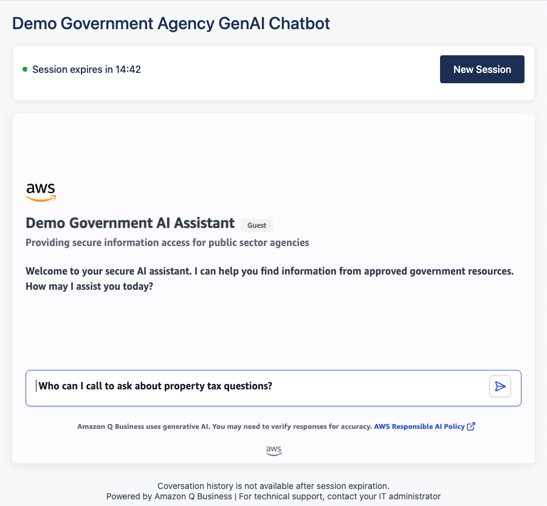
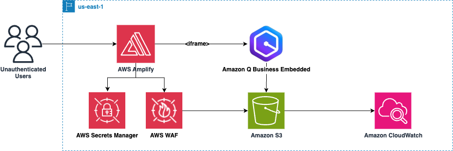
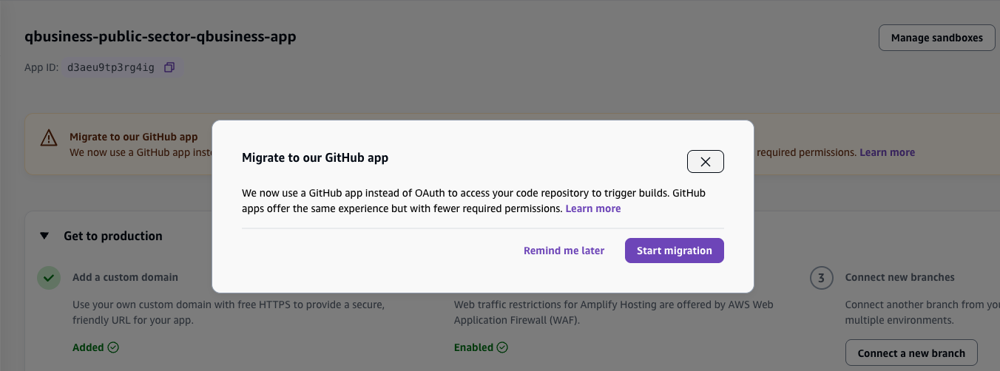

# Amazon Q Business Customized Web Application

[](LICENSE)
[](https://nodejs.org/)
[](https://aws.amazon.com/amplify/)

## Introduction

This scalable solution provides a customized Amazon Q Business web application designed to help public sector agencies securely accelerate their adoption of Generative AI.

The application features **custom theming** for organizational branding and **automatic session management** that creates new **[anonymous chat sessions](https://docs.aws.amazon.com/amazonq/latest/qbusiness-ug/using-web-experience.html#web-experience-anonymous)** for each user visit.

By leveraging Amazon Q Business's [anonymous web experience URLs](https://docs.aws.amazon.com/amazonq/latest/api-reference/API_CreateAnonymousWebExperienceUrl.html), the solution provides secure, temporary access without requiring user authentication.  



## Getting Started

#### Prerequisites:
- AWS Account with appropriate permissions
- Node.js 18+ installed locally
- AWS CLI configured
- Git repository
- Q Business Application (can be created by the script)

The AWS CLI needs to be configured with a profile that has CloudFormation, Amplify, Q Business, and Secrets Manager permissions.

## Setup

**Step 1: Clone the repository and install dependencies.**

```bash
git clone <repository-url>
cd qbamplify
npm install
```

**Step 2: Deploy the infrastructure.**

Deployment takes approximately 5-10 minutes.

```bash
./scripts/deploy.sh
```

The script will ask if you have existing Q Business resources and guide you through setup:

```
🏛️  Q Business Public Sector - Unified Deployment
================================================

Do you have existing Q Business resources? (y/n): n

🚀 Creating complete Q Business infrastructure from scratch...
Application name [GovernmentAIAssistant]: My Agency Assistant

Waiting for stack create/update to complete
Successfully created/updated stack - qbusiness-public-sector
✅ Infrastructure deployed successfully!

📤 Uploading theme assets...
✅ Theme assets uploaded successfully

📋 Your configuration:
+---------------------------+-----------------------------------------------------------------------------+
|  AmplifyComputeRoleArn    |  arn:aws:iam::123456789:role/qbusiness-public-sector-AmplifyComputeRole     |
|  QBusinessApplicationId   |  5a3318c9-d49f-4497-b9d4-dc80b7a55059                                       |
|  QBusinessWebExperienceId |  5a3318c9-d49f-4497-b9d4-dc80b7a55059|ae6d25c7-96be-4260-9d14-570dc9636d3e  |
|  AmplifyDefaultDomain     |  https://main.d3aeu9tp3rg4ig.amplifyapp.com                                 |
+---------------------------+-----------------------------------------------------------------------------+

🎉 Deployment complete!

Next steps:
1. Test locally: npm install && npm start
2. Your Amplify app will auto-deploy from your GitHub repository
```

**Step 3: Test locally (optional).**

```bash
npm install && npm start
```

Visit `http://localhost:3000` to test locally.

**Step 4: Deploy to Amplify.**

Connect your GitHub repository to AWS Amplify and deploy to production.

## Reference Architecture



Built with Express.js and deployed on AWS Amplify using CloudFormation for infrastructure management, this template creates a secure, themed Q Business deployment with the following components:

- **Q Business Application**: Anonymous access with custom theming
- **Web Experience**: Customized branding and styling
- **Amplify Hosting**: Server-side rendering with Express.js
- **WAF (Web Application Firewall)**: Security protection for the web application
- **Secrets Manager**: Secure storage of Q Business configuration
- **S3 Bucket**: Theme assets (CSS, fonts, logos)
- **IAM Roles**: Least-privilege permissions for Amplify compute

## Project Structure

```
qbamplify/
├── assets/                 # Theme assets (CSS, fonts, logos)
├── config/                 # Configuration files
├── docs/                   # Documentation
├── infrastructure/         # CloudFormation templates
├── scripts/                # Build and deployment scripts
└── src/                    # Express.js application
```

## Amplify GitHub App Migration

After deployment, you may see this message in the AWS Amplify console:



**Recommendation**: Click the "Start migration" button to migrate to the new GitHub App integration. This provides improved security, better permissions management, and enhanced CI/CD capabilities for your Amplify deployments.

## Cleanup

To remove all AWS resources created by this solution:

```bash
./scripts/cleanup.sh
```

## Contributing

See [CONTRIBUTING.md](CONTRIBUTING.md) for contribution guidelines.

## License

This project is licensed under the MIT-0 License. See [LICENSE](LICENSE) for details.

## Security

See [CONTRIBUTING.md](CONTRIBUTING.md#security-issue-notifications) for security issue reporting.