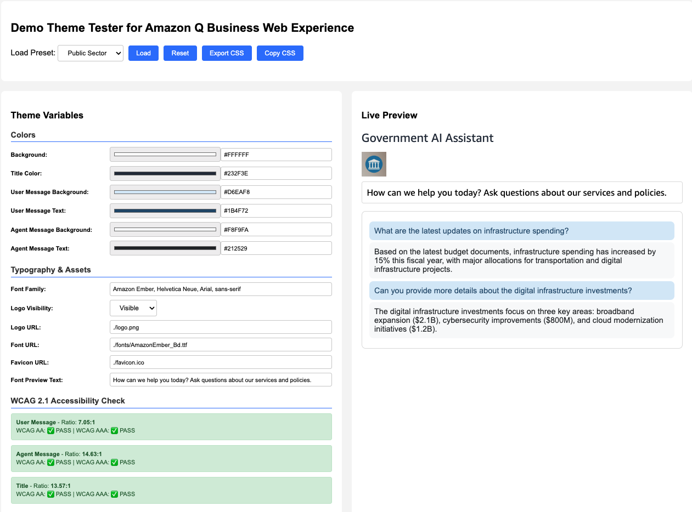

# Customization Guide

This guide shows how to customize your Amazon Q Business web experience to align with your organization's branding and user needs. For complete details, see the [official AWS documentation](https://docs.aws.amazon.com/amazonq/latest/qbusiness-ug/customizing-web-experience.html).

## What You Can Customize

### Landing Page


### Chat Interface


## Theme System

This project supports multiple themes through a flexible directory structure. Each theme contains all necessary assets for a complete visual identity.

### Theme Structure

Themes are organized in the `assets/themes/` directory:

```
assets/themes/
├── public-sector/           # Default government theme
│   ├── theme.css           # CSS variables and styling
│   ├── logo.png            # Organization logo
│   ├── favicon.ico         # Browser favicon
│   └── fonts/              # Custom fonts
│       └── AmazonEmber_Bd.ttf
├── healthcare/             # Healthcare industry theme
│   ├── theme.css
│   ├── logo.png
│   └── favicon.ico
└── financial/              # Financial services theme
    ├── theme.css
    ├── logo.png
    └── favicon.ico
```

### Theme Selection

Specify a theme during deployment:

```bash
# Use default public-sector theme
./scripts/deploy.sh

# Use healthcare theme
./scripts/deploy.sh my-stack main "repo-url" "token" "healthcare"

# Use financial theme  
./scripts/deploy.sh my-stack main "repo-url" "token" "financial"
```

### Creating Custom Themes

1. Create a new directory in `assets/themes/your-theme-name/`
2. Add required files: `theme.css`, `logo.png`, `favicon.ico`
3. Deploy with: `./scripts/deploy.sh stack main repo token your-theme-name`

## Theme Testing

Use the built-in theme tester to preview your customizations:



Open `assets/theme-test.html` in your browser to test CSS variables and see real-time changes without deploying.
## Customization Overview

Amazon Q Business offers customization options for:
- **Text elements**: Title, subtitle, welcome message, and sample prompts
- **Visual themes**: Logo, favicon, colors, and fonts
- **Custom CSS**: Advanced styling with supported CSS variables

These customizations persist even in Amazon Q embedded experiences and can be applied using either the AWS Management Console or the Amazon Q API.

## CSS Theme Variables

Each theme's `theme.css` file contains CSS variables for customization:

```css
:root {
  /* Core styling */
  --background: #FFFFFF;
  --qbusiness-webexperience-title-color: #232F3E;
  --qbusiness-webexperience-font-typeface: 'Amazon Ember', 'Helvetica Neue', Arial, sans-serif;
  
  /* Chat styling */
  --qbusiness-webexperience-chat-user-background-color: #D6EAF8;
  --qbusiness-webexperience-chat-user-text-color: #1B4F72;
  --qbusiness-webexperience-chat-agent-background-color: #F8F9FA;
  --qbusiness-webexperience-chat-agent-text-color: #212529;
  --qbusiness-webexperience-chat-logo-visibility: visible;
  
  /* Asset URLs */
  --qbusiness-webexperience-logo-url: url('./logo.png');
  --qbusiness-webexperience-font-url: url('./fonts/AmazonEmber_Bd.ttf');
  --qbusiness-webexperience-favicon-url: url('./favicon.ico');
}
```

### Supported CSS Variables

Amazon Q Business supports these root CSS variables:

**Core Colors:**
- `--background`, `--foreground`, `--primary`, `--secondary`
- `--card`, `--popover`, `--tooltip`, `--muted`, `--accent`
- `--info`, `--success`, `--warning`, `--error`, `--destructive`

**Q Business Specific:**
- `--qbusiness-webexperience-title-color`
- `--qbusiness-webexperience-font-typeface`
- `--qbusiness-webexperience-chat-user-background-color`
- `--qbusiness-webexperience-chat-user-text-color`
- `--qbusiness-webexperience-chat-agent-background-color`
- `--qbusiness-webexperience-chat-agent-text-color`
- `--qbusiness-webexperience-chat-logo-visibility`

## Supported File Types

- **Logos and favicons**: `image/svg+xml`, `image/x-icon`, `image/png` (1MB max)
- **Custom fonts**: `font/ttf`, `font/otf`, `font/woff`, `font/woff2`

**Note**: Download the official Amazon Ember font from the [Amazon Developer Typography Guidelines](https://developer.amazon.com/en-US/alexa/branding/echo-guidelines/identity-guidelines/typography)
## Application Wrapper Styling

The outer application layout is styled in `src/styles.css`:
- Header, timer, and button styling
- Mobile-responsive design
- Loading states and error messages
- Container layout around the Q Business iframe

```css
@media (max-width: 768px) {
  body { padding: 12px; }
  h1 { font-size: 24px; }
  #qbusiness-iframe { height: 60vh; }
}
```

## Accessibility Considerations

When customizing colors:
- Ensure sufficient contrast between text and background colors
- Use tools like [WebAIM Contrast Checker](https://webaim.org/resources/contrastchecker/) to verify WCAG 2.x compliance
- Test with screen readers and keyboard navigation
- Follow [Web Content Accessibility Guidelines (WCAG)](https://www.w3.org/TR/WCAG21/)

## Session Configuration

Configure session settings in `config/.env`:

```env
SESSION_DURATION_MINUTES=30  # 15-60 minutes
QBUSINESS_CONFIG_ID=your-secrets-manager-secret-name
```

## Deployment Process

After making customizations:

1. **Local testing**: `npm start` (uses `config/.env`)
2. **Theme asset upload**: Use `scripts/upload-theme-assets.sh` with parameters:
   ```bash
   ./scripts/upload-theme-assets.sh [stack-name] [theme-dir]
   ```
   **Parameters:**
   - `stack-name` (optional): CloudFormation stack name (default: "qbusiness-public-sector")
   - `theme-dir` (optional): Theme directory name from `assets/themes/` (default: "public-sector")
   
   **Examples:**
   ```bash
   # Use defaults
   ./scripts/upload-theme-assets.sh
   
   # Custom stack and theme
   ./scripts/upload-theme-assets.sh my-stack healthcare
   
   # Custom stack, default theme
   ./scripts/upload-theme-assets.sh my-stack
   ```
3. **Deploy changes**: Push to your connected GitHub repository
4. **Amplify auto-deploys**: Changes appear in 2-3 minutes

### S3 Requirements for Theme Assets

- All S3 URIs must be in the same AWS Region as your Q Business application
- For private S3 buckets:
  - Disable access control lists (ACLs)
  - Add appropriate bucket policies for Q Business access
  - Configure KMS key policies if using KMS encryption

## Embedding Amazon Q Business

This project demonstrates how to embed Amazon Q Business into a custom web application using anonymous web experiences. For complete details, see [Add Amazon Q embedded to your website](https://docs.aws.amazon.com/amazonq/latest/qbusiness-ug/embed-web-experience.html).

### Implementation Approach

The application uses server-side rendering to generate anonymous URLs and embed them in an iframe:

```javascript
// Generate anonymous URL on each page load
const command = new CreateAnonymousWebExperienceUrlCommand({
  applicationId: qbusinessConfig.QBUSINESS_APP_ID,
  webExperienceId: qbusinessConfig.QBUSINESS_WEB_EXP_ID,
  sessionDurationInMinutes: parseInt(process.env.SESSION_DURATION_MINUTES || '15', 10)
});
const response = await client.send(command);

// Embed in iframe with minimum 450px width
<iframe id="qbusiness-iframe" src="${response.anonymousUrl}" style="min-width: 450px;"/>
```

### Key Requirements for Anonymous Applications

- **Dynamic URL generation**: Anonymous URLs must be generated for each session using the `CreateAnonymousWebExperienceUrl` API
- **Session management**: URLs expire based on the configured session duration (15-60 minutes)
- **Minimum width**: Iframe must have a minimum width of 450 pixels
- **Third-party cookies**: May need to be enabled in browsers with limited cookie modes

### Browser Considerations

- **Incognito/Private mode**: May require enabling third-party cookies
- **Clipboard access**: Add `allow="clipboard-read; clipboard-write"` to iframe for copy functionality
- **Mobile responsiveness**: Application adjusts iframe height for mobile devices

## Advanced Customization

### API-Based Customization

Use the AWS CLI or SDK for programmatic customization:

```bash
# Update text elements
aws qbusiness update-web-experience \
  --application-id application-id \
  --web-experience-id web-experience-id \
  --title "Your Custom Title" \
  --subtitle "Your Custom Subtitle" \
  --welcome-message "Welcome to our AI assistant"

# Update visual theme
aws qbusiness update-web-experience \
  --application-id application-id \
  --web-experience-id web-experience-id \
  --customization-configuration '{"customCSSUrl":"s3://bucket/theme.css","logoUrl":"s3://bucket/logo.png"}'
```

## Reference Links

- [AWS Q Business Customization Documentation](https://docs.aws.amazon.com/amazonq/latest/qbusiness-ug/customizing-web-experience.html)
- [Customizing Text Elements](https://docs.aws.amazon.com/amazonq/latest/qbusiness-ug/customizing-web-experience-text-elements.html)
- [Customizing Visual Themes](https://docs.aws.amazon.com/amazonq/latest/qbusiness-ug/customizing-web-experience-themes.html)
- [CSS Variables Reference](https://docs.aws.amazon.com/amazonq/latest/qbusiness-ug/customizing-web-experience-themes-reference-materials.html)
- [WebAIM Contrast Checker](https://webaim.org/resources/contrastchecker/)
- [WCAG Guidelines](https://www.w3.org/TR/WCAG21/)
