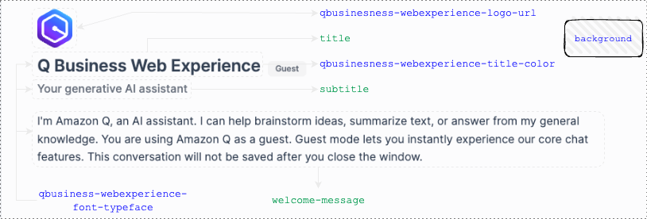
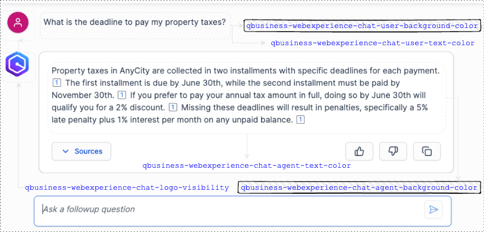

# Customization Guide

## What You Can Customize

### Landing Page


### Chat Interface


## Theme Assets

All theme files are in the `assets/` directory and automatically uploaded to S3 during deployment.

### Logo Customization

Replace these files with your organization's branding:
- `assets/logo.png` - Main logo (recommended: 200x50px)
- `assets/favicon.ico` - Browser favicon

### CSS Styling

Edit `assets/styles.css` to customize:
- Colors and branding
- Fonts and typography
- Layout and spacing
- Mobile responsiveness

### Custom Fonts

Add font files to `assets/fonts/` and reference them in `styles.css`:

```css
@font-face {
    font-family: 'YourFont';
    src: url('./fonts/yourfont.woff2') format('woff2');
}
```

## Session Configuration

Modify session duration in `config/.env`:

```env
SESSION_DURATION_MINUTES=30  # 15-60 minutes
```

## Application Settings

The main application settings are configured in `src/index.js`:
- Page title and metadata
- Session timer display
- Error handling messages

## Deployment

After making changes:

1. **Local testing**: `npm start`
2. **Deploy changes**: Push to your connected GitHub repository
3. **Amplify auto-deploys**: Changes appear in 2-3 minutes

## Advanced Customization

### Custom HTML Templates

Modify the embedded iframe and surrounding HTML in `src/index.js`:
- Session timer display
- Loading states
- Error messages
- Page layout

### Mobile Responsiveness

The default CSS includes mobile-responsive design. Customize breakpoints in `assets/styles.css`:

```css
@media (max-width: 768px) {
    /* Mobile styles */
}
```